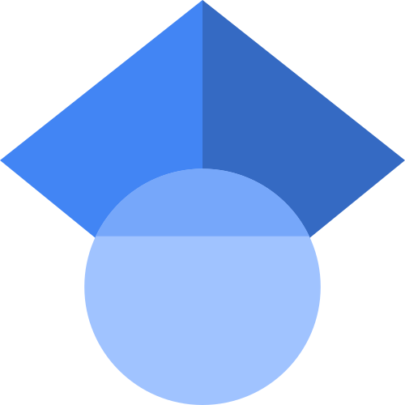

::: {.columns}

::: {.column width="30%"}

Astrophysics team

Room HL102A

+33 1 44 32 39 93

francois.levrier@ens.fr

[LPENS](https://www.lpens.ens.psl.eu/) - [ENS](https://www.ens.psl.eu/) - [PSL](https://psl.eu/)

 [NASA ADS](https://ui.adsabs.harvard.edu/search/p_=0&q=author%3A(%22levrier%2C%20f%22)&sort=date%20desc%2C%20bibcode%20desc)
 
 [Google Scholar](https://scholar.google.com/citations?hl=en&user=LG1x7ZIAAAAJ&view_op=list_works&sortby=pubdate)  

<i class="bi bi-bluesky"></i> [Bluesky](https://bsky.app/profile/francoislevrier.bsky.social)
 
<i class="bi bi-twitter"></i> [Twitter](https://twitter.com/FrancoisLevrier) 

Loading latest Bluesky post...

:::

::: {.column width="70%"}

I am a professor of astrophysics in the [Physics Department](https://www.phys.ens.fr/fr) of [Ecole Normale Supérieure](https://www.ens.psl.eu/). 

My research focuses on the structure and dynamics of the interstellar medium, from the diffuse regions to dense molecular clouds where stars are born, using methods imported from data science at the interface between observations and simulations. 

Together with [Aude Simon](https://www.lcpq.ups-tlse.fr/spip.php?article1130) I coordinate the "Action Thématique" [PCMI](https://www.pcmi.cnrs.fr/) ("Physique et Chimie du Milieu Interstellaire") of [CNRS](https://www.cnrs.fr/fr) ["Terre & Univers"](https://www.insu.cnrs.fr/fr).

I teach at various levels, from L3 to M2, from general physics to my field of expertise, and I am co-head of the [Master AADC](https://ufe.obspm.fr/formations/master/master-2-suts-parcours-aadc/).

---

## Latest publication

---

## Lecture notes

- [Introduction à l'astrophysique](files/Teaching/Polycopie-L3-Astrophysique-2025.pdf) (L3 ENS) {width=20}
- [Statistical physics](files/Teaching/Statistical-Physics-2025-2026.pdf) (M1 SUTS) {width=20}
- [Milieu interstellaire et formation des étoiles](files/Teaching/T07-2025-2026-Complet.pdf) (M2 AADC) {width=20}
- [Incertitudes expérimentales](files/Teaching/Incertitudes-2025-2026.pdf) (Préparation à l'agrégation de physique) {width=20}

---

---

<iframe src="https://calendar.google.com/calendar/embed?src=ZnJhbmNvaXMubGV2cmllckBnbWFpbC5jb20"
style="border:0"
width="600"
height="400"
frameborder="0"
scrolling="no"></iframe>

:::

:::

---

